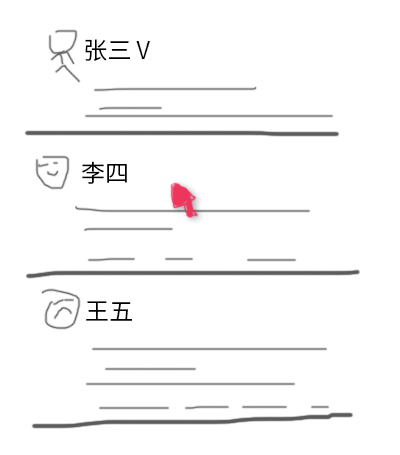

题目：实现一个浮层卡片
========================

鼠标 hover 用户名，ajax 请求接口，显示详细用户信息。效果见示意图。



假设用户信息接口为：`/user/detail?uid=:uid`，返回数据：

```json
{
    "success": true,
    "data": {
        "uid": "11111111",
        "nickname": "张三",
        "bio": "Hello World!",
        "following": 222,
        "followers": 111
    }
}
```
